# Ephy-RSA

Ephy-RSA is a lightweight encryption library for securely exchanging data between a frontend application and a backend server. It generates **ephemeral RSA key pairs** in browser memory, ensuring that sensitive data is **encrypted before transmission** and that **no keys are persistently stored**. This prevents plaintext exposure in browser network logs and enhances security.

## tl;dr

Below is a **Sequence Diagram** illustrating the encryption and decryption process:


## 🚀 Features

- 🔐 **Ephemeral RSA Key Pairs** – No keys are stored persistently on the frontend.
- 🔄 **Client-Side Encryption** – Data is encrypted before leaving the browser.
- 🚀 **Easy Integration** – Works seamlessly with JSON Web Encryption (JWE) using `jose`.
- 🔒 **No Plaintext Exposure** – Data remains encrypted in transit.

---

## 🏗 Installation

```sh
npm install ephy-rsa
```

OR

```sh
yarn add ephy-rsa
```

---

## 🔄 How It Works

```mermaid
sequenceDiagram
    participant 🖥 Client
    participant 🔐 Backend

    note over 🖥 Client: 1️⃣ Generate Ephemeral RSA Key Pair 🗝️
    🖥 Client->>🖥 Client: Generate RSA Key Pair
    🖥 Client->>🖥 Client: Store Private Key in Memory 🧠

    note over 🔐 Backend: 2️⃣ Server Key Management 🏢
    🔐 Backend->>🔐 Backend: Generate & Store RSA Key Pair 🔑

    note over 🖥 Client: 3️⃣ Encrypt Data Before Sending ✉️🔒
    🖥 Client->>🔐 Backend: Request Public Key 📡
    🔐 Backend-->>🖥 Client: Send Server Public Key 📜
    🖥 Client->>🖥 Client: Encrypt Data using Server Public Key 🛡️
    🖥 Client->>🔐 Backend: Send Encrypted Data 📦 along with client's public key

    note over 🔐 Backend: 4️⃣ Decrypt Data Securely 🔓
    🔐 Backend->>🔐 Backend: Decrypt Data using Private Key 🔑
    🔐 Backend->>🔐 Backend: Encrypt Response Data using Client's Public Key 🔑
    🔐 Backend-->>🖥 Client: Return Encrypted Response 📬

    note over 🖥 Client: 4️⃣ Decrypt Response Data With its Ephemeral Private key 🔓
```



---

## 🛠 Usage

### 🖥 Frontend (Client-Side)

1️⃣ **Initialize the Library and Generate an Ephemeral Key Pair**

```javascript
import RSAKeyService from "ephy-rsa";

(async () => {
  const rsaService = await RSAKeyService();
  console.log("Public Key:", rsaService.getPublicKey());
})();
```

2️⃣ **Encrypt Request Payload with the Server's Public Key**

```javascript
(async () => {
  const rsaService = await RSAKeyService();

  const serverPublicKey = "your-server-public-key-in-JWK-or-PEM-format";
  const encryptedData = await rsaService.encryptWithServerPublicKey(
    "Sensitive Data",
    serverPublicKey,
  );
  console.log("Encrypted Data:", encryptedData);
})();
```

3️⃣ **Decrypt Response Data with the Ephemeral Private Key**

```javascript
(async () => {
  const rsaService = await RSAKeyService();

  const encryptedData = "..."; // Encrypted string received from backend
  const decryptedData = await rsaService.decryptWithPrivateKey(encryptedData);

  console.log("Decrypted Data:", decryptedData);
})();
```

---

### 🖥 Backend (Server-Side)

The backend should:

1. **Generate an RSA Key Pair** and expose the **public key** to the frontend.
2. **Decrypt incoming encrypted messages** using the **private key**.
3. **Encrypt responses** using **client's public key**.

#### Example Backend Code (Node.js using `jose`)

```javascript
import * as jose from "jose";
import fs from "fs";

// Load RSA Private Key (PEM format)
const privateKeyPem = fs.readFileSync("./private.pem", "utf8");
const privateKey = await jose.importPKCS8(privateKeyPem, "RSA-OAEP");

// Load RSA Public Key (PEM format)
const publicKeyPem = fs.readFileSync("./public.pem", "utf8");
const publicKey = await jose.importSPKI(publicKeyPem, "RSA-OAEP");

// Decrypt received encrypted data
async function decryptData(encryptedData) {
  const decrypted = await jose.compactDecrypt(encryptedData, privateKey);
  console.log("Decrypted Data:", new TextDecoder().decode(decrypted.plaintext));
}

// Encrypt responses
async function encryptResponse(response, clientPublicKey) {
  const encrypted = await jose.compactEncrypt(
    JSON.stringify(response),
    clientPublicKey,
  );
  console.log("Encrypted Response:", new TextDecoder().decode(encrypted));
}

export { publicKey, decryptData, encryptResponse };
```

The **public key** should be **exposed via an API endpoint**, so the frontend can retrieve it and use it for encryption.

---

## 🔀 API Reference

### `RSAKeyService(algorithm?: RsaHashedKeyGenParams): Promise<RSAKeyService>`

Creates an instance of `RSAKeyService`. You can optionally specify an RSA key generation algorithm.

### `getPublicKey(): string | null`

Returns the **Base64-encoded PEM public key** of the generated RSA key pair.

### `encryptWithServerPublicKey(data: string, jwkPublicKey: JsonWebKey | string, alg?: "RSA-OAEP" | "RSA-OAEP-256", enc?: "A128GCM" | "A256GCM"): Promise<string>`

Encrypts the given data using the server’s **public key**. The key can be in **JWK** or **PEM/Base64** format.

### `decryptWithPrivateKey(encryptedData: string): Promise<string>`

Decrypts the given encrypted data using the **ephemeral private key** stored in memory.

---

## 🔒 Security Considerations

- **Frontend:**

  - Private keys are never stored persistently – They exist only in memory and are lost when the page refreshes.
  - Protect against XSS attacks – Since in-memory keys can be accessed if malicious scripts are injected.
  - Use HTTPS – To prevent man-in-the-middle attacks.
  - Implement a strong Content Security Policy (CSP) – To restrict script execution and mitigate injection risks.

- **Backend:**
  - Store the private key securely.
  - Restrict access to the decryption endpoint.
  - Ensure proper authentication and authorization before decrypting data.

---

## 📖 TypeScript Interface

```typescript
interface RSAKeyService {
  getPublicKey(): string | null;
  encryptWithServerPublicKey(
    data: string,
    jwkPublicKey: JsonWebKey | string,
    alg?: "RSA-OAEP" | "RSA-OAEP-256",
    enc?: "A128GCM" | "A256GCM",
  ): Promise<string>;
  decryptWithPrivateKey(encryptedData: string): Promise<string>;
}
```

---

## 🏷 Keywords

`reactjs`, `nextjs`, `RSA`, `AES`, `encryption`, `decryption`, `hybrid`, `jose`, `cryptography`, `browser`, `secure`, `ephemeral`

---

## 📝 License

This project is licensed under the MIT License

---

## ❤️ Contributing

Contributions are welcome! Feel free to open issues or pull requests or reach out to me via GitHub Issues.
